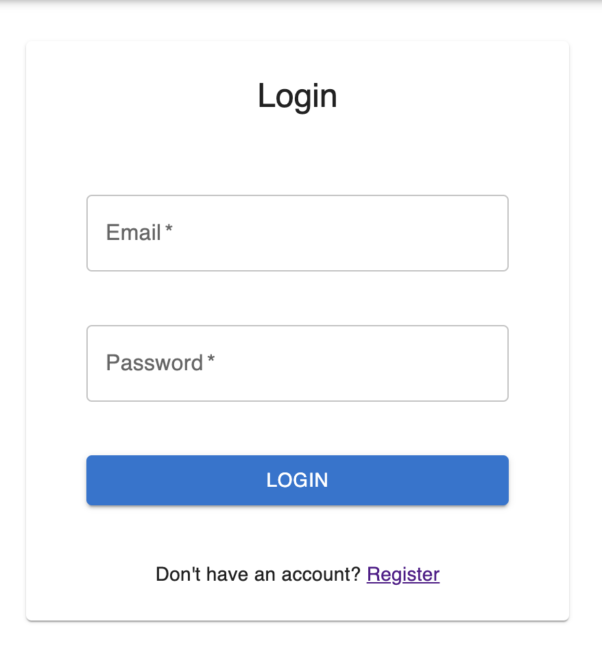
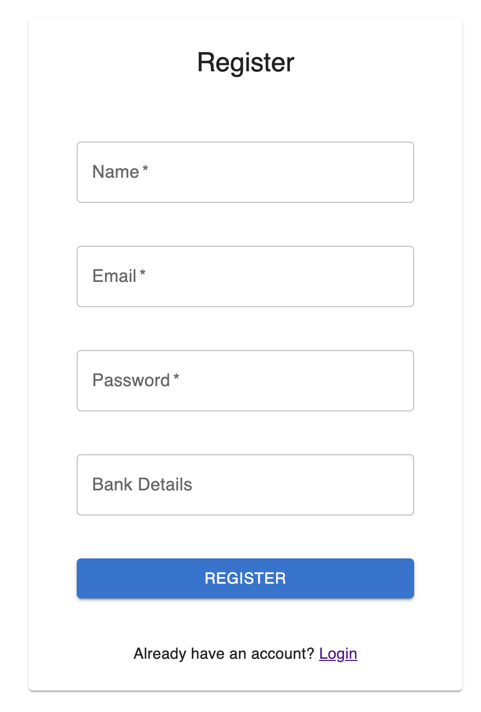
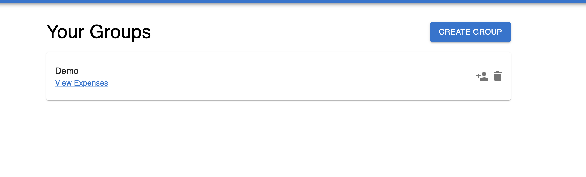
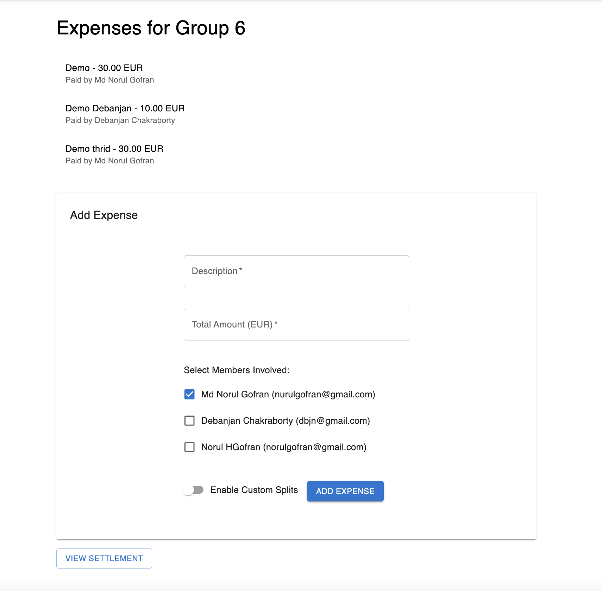
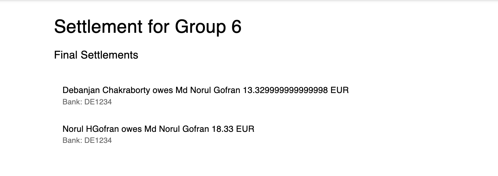

# ExpenseMate

ExpenseMate is a web application designed to simplify the process of managing and settling shared expenses within groups. It’s perfect for traveling friends, roommates splitting household costs, or any group event requiring clear expense tracking and fair settlement calculations.

## Overview

**What does ExpenseMate do?**

- **Create and Manage Groups:** Start by creating a group for a single event (e.g., “Spain Trip 2024”).
- **Add Members:** Easily add friends to the group so everyone can participate.
- **Record Expenses:** Any member can log expenses, specifying how the cost is split—either equally by default or custom amounts per member.
- **Automated Settlements:** At the end of the event, ExpenseMate automatically computes who owes whom, minimizing the number of required transactions.
- **Manual Payments:** ExpenseMate displays each payee’s bank details for easy external transfers.

## App Visualization

Below are some screenshots illustrating ExpenseMate’s interface and features:

**Login Page:**  
*(Users must log in to access their groups and expenses)*  


**Register Page:**  
*(Register by providing basic information and optional bank details)*  


**Group Dashboard:**  
*(View your groups, create a new one, add members, or delete existing ones)*  


**Expenses Page:**  
*(Record new expenses, select members involved, and choose between equal or custom splitting)*  


**Settlement Page:**  
*(View final settlements, who owes whom, and their bank details)*  


## Key Features

1. **User Authentication:** Secure login and registration process.
2. **Group Creation & Membership Management:** Create event-based groups and add members with ease.
3. **Flexible Expense Splitting:**  
   - **Equal Splits:** Automatically divide costs equally among selected members.  
   - **Custom Splits:** Assign exact amounts to each member for non-standard cost allocations.
4. **Automated Settlement Calculation:** Simplifies the final settlement so everyone knows who owes whom.
5. **Bank Details Display:** Shows payees’ bank information for simple external transfers.
6. **Responsive UI:** Clean and minimalistic interface for an intuitive user experience.

## Getting Started

### Prerequisites

- **Node.js and npm** installed
- **PostgreSQL** or another configured database
- Basic knowledge of running Node.js and React apps

### Setup Instructions

1. **Clone the Repository:**
   ```bash
   git clone https://github.com/<yourusername>/ExpenseMate.git
   cd ExpenseMate

	2.	Install and Run Backend:

cd backend
npm install
npm run migrate
npm run seed
npm start

Backend server runs at http://localhost:4000.

	3.	Install and Run Frontend:

cd ../frontend
npm install
npm start

Frontend runs at http://localhost:8080.

	4.	Access the App:
Open http://localhost:8080 in your browser. Register or log in, then create groups and add expenses.

Configuration
	•	Database: Check config/default.json for DB config.
	•	Authentication: Uses JWT. Store your jwtSecret in config.

Technologies Used
	•	Frontend: React, Material UI
	•	Backend: Node.js, Express.js, Knex.js
	•	Database: PostgreSQL
	•	Real-Time Updates: Socket.io (planned enhancements)

Contributing

Contributions are welcome!
	1.	Fork the repo.
	2.	Create a new feature branch:

git checkout -b feature/my-new-feature


	3.	Commit and push your changes:

git add .
git commit -m "Add new feature"
git push origin feature/my-new-feature


	4.	Open a Pull Request detailing your changes.

License

This project is licensed under the MIT License.

Future Enhancements
	•	Multiple Currencies: Convert expenses and handle exchange rates.
	•	Mobile App: A native or PWA version for on-the-go expense management.
	•	Advanced Permissions: More granular group roles and permissions.
	•	Data Export: Export settlement data as CSV or PDF.


